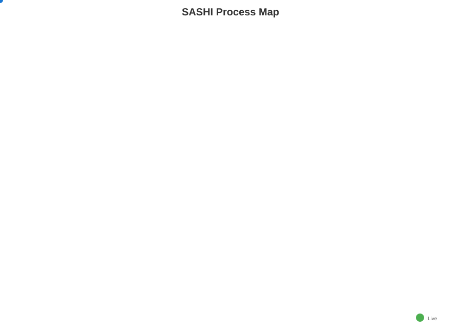
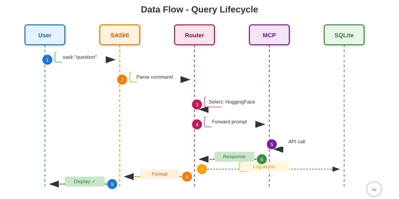
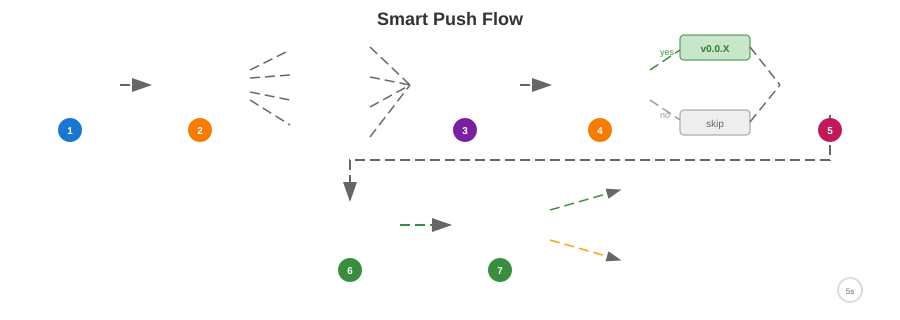

# SASHI - Smart AI Shell Interface

> Local-first AI assistant powered by Ollama/Llama. Privacy-first, no data leaves your machine. Runs on modest hardware (i7, 8GB RAM, no GPU). Optional cloud fallback via OpenRouter.

[](https://github.com/tmdev012/ollama-local)
[]()
[]()

---

## Table of Contents

- [Overview](#overview)
- [Performance Tuning](#performance-tuning)
- [Architecture](#architecture)
- [Models](#models)
- [MCP Structure](#mcp-structure)
- [Installation](#installation)
- [Usage](#usage)
- [Termux (Mobile)](#termux-mobile)
- [SQLite Schema](#sqlite-schema)
- [Aliases Reference](#aliases-reference)
- [Smart Push](#smart-push)
- [Session Timeline](#session-timeline)

---

## Overview

SASHI routes all queries through `ollama run` (native CLI, streaming, model stays hot). No cloud dependency. No API keys required for local use.

```
┌─────────────────────────────────────────────────────────────┐
│                      USER INPUT                              │
│            text / voice / pipe / interactive                 │
└─────────────────────────────────────────────────────────────┘
                            │
                            ▼
┌─────────────────────────────────────────────────────────────┐
│                     SASHI v3.2.2                             │
│  ┌─────────┐  ┌─────────┐  ┌─────────┐  ┌─────────┐        │
│  │ Router  │→ │ Logger  │→ │ History │→ │ Output  │        │
│  └─────────┘  └─────────┘  └─────────┘  └─────────┘        │
└─────────────────────────────────────────────────────────────┘
        │              │              │              │
        ▼              ▼              ▼              ▼
┌───────────┐  ┌───────────┐  ┌───────────┐  ┌───────────┐
│  Llama    │  │OpenRouter │  │   Gmail   │  │   Voice   │
│  Ollama   │  │  (Cloud)  │  │    API    │  │  Google   │
│  (Local)  │  │ (Fallback)│  │  (OAuth)  │  │   STT     │
└───────────┘  └───────────┘  └───────────┘  └───────────┘
   Primary       Optional        Context        Input
```

### Process Map



### Data Flow



### Smart Push Flow



---

## Performance Tuning

Benchmarked and optimized for CPU-only hardware (no GPU). These settings were proven across 3 rounds of benchmarking on an i7-6500U (2 cores, 4 threads, 7.6GB RAM, 8GB swap).

### Why These Settings Matter

| Setting | Wrong Value | Right Value | What Happens |
|---------|-------------|-------------|-------------|
| `num_thread` | 4 (all threads) | **2** (physical cores) | HT contention = **30% slower** with 4 threads |
| CPU governor | `powersave` | **`performance`** | Prevents CPU throttling mid-inference |
| `OLLAMA_MAX_LOADED_MODELS` | default | **1** | Prevents 2 models fighting for RAM |
| `OLLAMA_KEEP_ALIVE` | 5m | **30m** | Model stays hot between queries |
| `OLLAMA_NUM_PARALLEL` | default | **1** | Single user = no parallel overhead |

### Apply Optimizations (one time)

```bash
# 1. CPU governor (needs sudo)
echo performance | sudo tee /sys/devices/system/cpu/cpu*/cpufreq/scaling_governor

# 2. Ollama service tuning (needs sudo)
sudo mkdir -p /etc/systemd/system/ollama.service.d
cat << 'OVR' | sudo tee /etc/systemd/system/ollama.service.d/override.conf
[Service]
Environment="OLLAMA_NUM_PARALLEL=1"
Environment="OLLAMA_MAX_LOADED_MODELS=1"
Environment="OLLAMA_KEEP_ALIVE=30m"
OVR
sudo systemctl daemon-reload && sudo systemctl restart ollama

# 3. Build optimized models (no sudo)
ollama create fast-sashi -f ~/ollama-local/Modelfile.fast
ollama create sashi-llama -f ~/ollama-local/Modelfile.system
```

### Benchmark Proof

Tested with identical prompts (coding, reasoning, knowledge). Eval rate = tokens/second during generation.

**Why `num_thread 2` beats `num_thread 4`:**

| num_thread | 3B tok/s | 8B tok/s | Notes |
|------------|----------|----------|-------|
| 4 (all threads) | 2.8 | 3.0 | HT contention kills throughput |
| **2 (physical cores)** | **4.0** | **3.7** | **+43% on 3B, +23% on 8B** |

On a 2-core/4-thread CPU, hyperthreading competes for the same execution units. LLM inference is pure compute — it needs real cores, not virtual ones.

### Hardware Speed Ceiling

| Model | Eval Rate | Cold Start | Hot Query Time |
|-------|-----------|------------|----------------|
| sashi-llama (3B) | ~4.0 tok/s | 5s | ~35s |
| sashi-llama-8b (8B) | ~3.7 tok/s | 60s (swap) | ~40s |

The bottleneck is memory bandwidth, not CPU clock. This is the ceiling for this hardware.

---

## Architecture

### BDPM Governance Layer (v3.2.2)

The 4-layer BDPM governance model spans both repos. See the full swimlane diagram in [`kanban-pmo/docs/diagrams/bdpm-swimlanes.svg`](../kanban-pmo/docs/diagrams/bdpm-swimlanes.svg):

- **Business** — kanban-pmo intake, sprint planning, milestone gates
- **Development** — git push, model build, test verify, smart-push (this repo)
- **Production** — gRPC pipeline dispatch, ollama inference, file write, DB log (this repo)
- **Monitoring** — cred audit, health check, doc sync, CMMI compliance

### Credential Layer

`persist-memory-probe/lib/sh/gatekeeper_3_1_0.sh` is the credential gateway. It delegates inference to ollama-local while owning github/sign/remote routes. All `sashi` sub-commands (kanban, probe, write) pass through the gatekeeper before hitting the gRPC layer.

### Directory Structure

```
ollama-local/
├── sashi                    # Main CLI (v3.2.2)
├── .env                     # Config (LOCAL_MODEL, OLLAMA_HOST)
├── .env.termux              # Termux override (llama3.2:1b)
├── Modelfile.fast            # 3B fast model (concise system prompt, default)
├── Modelfile.system         # 3B full model config (comprehensive system prompt)
├── Modelfile.8b             # 8B model config (num_thread 2, system prompt) [archived]
├── install.sh               # One-command installer
├── docker-compose.yml       # Container orchestration
│
├── db/
│   └── history.db           # SQLite WAL (10 tables, 27 indexes)
│
├── docs/
│   ├── termux-ollama-plan.md  # Model sizing, swap analysis
│   ├── termux-setup.md        # Phone install guide
│   └── monetization.md        # Revenue playbook
│
├── mcp/                     # Model Context Protocol
│   ├── claude/              # Claude Code integration
│   ├── llama/               # Local llama tools, ai-orchestrator
│   ├── gmail/               # Gmail CLI (search, recent, export)
│   └── voice/               # Voice input (CLI + GUI)
│
├── lib/
│   └── sh/
│       ├── banner.sh        # sashi_banner() ASCII art — sourced by all tools
│       ├── aliases.sh       # Shell aliases — 80+ total incl. 30 filesystem (v3.2.2)
│       ├── usb-monitor.sh   # USB vendor DB + sysfs scanner
│       └── wifi-debug.sh    # ADB WiFi library
│
├── scripts/
│   ├── smart-push.sh        # 424-line git automation
│   ├── rebuild-models.sh    # Rebuild fast-sashi + sashi-llama-8b from Modelfiles
│   ├── android-setup.sh     # Downloads + installs Android SDK, platform-tools, adb
│   ├── termux-sync.sh       # Desktop ↔ phone sync
│   ├── git-setup.sh         # SSH/GitHub setup
│   └── git-aliases.sh       # Git alias installer
│
└── old-archive/             # Archived sessions (never deleted)
```

## Models

### Available Models

| Model | Params | Size | Speed | Modelfile | Use Case |
|-------|--------|------|-------|-----------|----------|
| **fast-sashi** | 3B | 2.0GB | 4.0 tok/s | `Modelfile.fast` | **Default** — concise, date-aware |
| **sashi-llama** | 3B | 2.0GB | 4.0 tok/s | `Modelfile.system` | Full system prompt, verbose context |
| **sashi-llama-8b** | 8B | 4.9GB | 3.7 tok/s | `Modelfile.8b` | Better quality, needs swap |
| llama3.2:1b | 1B | 1.3GB | fast | (base) | Termux/mobile — lightweight |

### Model Selection

```bash
# Desktop default (fast-sashi, 3B, concise)
sashi ask "explain TCP"

# Full context model (bigger system prompt)
ollama run sashi-llama "explain TCP in detail"

# Switch to 8B for quality (edit .env: LOCAL_MODEL=sashi-llama-8b)
ollama run sashi-llama-8b "explain TCP in detail"

# Termux auto-detects and uses 1B
# (handled by .env.termux override)
```

All custom models include system prompts with date awareness. The default `fast-sashi` is concise; `sashi-llama` has full hardware/file/alias context.

---

## MCP Structure

### MCP Groups

| Category | Name | Type | Description |
|----------|------|------|-------------|
| **Core** | sashi | CLI | Main router and interface |
| **Model** | llama | Local | Llama 3.2/3.1 via Ollama — primary |
| **Model** | claude | Integration | Claude Code CLI — complex tasks |
| **Automation** | pipeline | gRPC | Inference + file write + orchestration |
| **Protocol** | voice | Input | Google Speech-to-Text |
| **Protocol** | gmail | Context | Gmail API for email data |

### Route Comparison

| Route | Type | Speed | Context | Cost | Use Case |
|-------|------|-------|---------|------|----------|
| `sashi ask` | Local (3B) | ~4 tok/s | 4K | Free | Quick queries |
| `sashi ask` (8B) | Local (8B) | ~3.7 tok/s | 4K | Free | Better reasoning |
| `sashi online` | Cloud (OpenRouter) | ~2s | varies | Free tier | When local isn't enough |

---

## Installation

### One-liner (recommended)

```bash
curl -fsSL https://raw.githubusercontent.com/tmdev012/ollama-local/main/install.sh | bash
```

Then reload your shell:

```bash
source ~/.bashrc   # or source ~/.zshrc
sashi status
```

The installer handles everything: Ollama, llama3.2 model, CPU tuning, DB init, shell aliases.

#### Flags

```bash
# Skip model download (if you already have llama3.2)
curl -fsSL .../install.sh | bash -s -- --no-models

# Skip CPU governor tuning (e.g. on a server)
curl -fsSL .../install.sh | bash -s -- --no-gpu-tune

# Termux / Android
curl -fsSL .../install.sh | bash -s -- --termux
```

### Manual Install (Linux)

```bash
# 1. Install Ollama
curl -fsSL https://ollama.ai/install.sh | sh
sudo systemctl enable --now ollama

# 2. Clone repo
git clone https://github.com/tmdev012/ollama-local.git ~/ollama-local

# 3. Pull base model + build optimized custom models
ollama pull llama3.2
ollama create fast-sashi -f ~/ollama-local/Modelfile.fast

# 4. (Optional) 8B model — needs 8GB+ swap
ollama pull llama3.1:8b
ollama create sashi-llama-8b -f ~/ollama-local/Modelfile.8b

# 5. Apply performance tuning (see Performance Tuning section above)

# 6. Add to shell
echo 'export PATH="$HOME/ollama-local:$PATH"' >> ~/.bashrc
echo 'source ~/ollama-local/lib/sh/aliases.sh' >> ~/.bashrc
source ~/.bashrc
```

### Docker

```bash
docker-compose up -d
docker exec -it sashi-ai bash
```

---

## Usage

### Basic Commands

```bash
# Quick question (local llama 3B)
sashi ask "What is Python?"
sask "Explain REST APIs"

# 8B quality route (better reasoning)
sashi 8b "Explain async/await in depth"
s8b "complex question"

# Code help
sashi code "Write a sorting function in Python"
scode "Write a sorting function in Python"

# Interactive chat (streams via ollama run)
sashi chat
schat

# Cloud fallback (when local isn't enough)
sashi online "Explain quantum computing in depth"
sonline "complex question here"

# Voice input
sashi voice              # Single prompt
sashi voice --continuous # Keep listening
sashi voice --gui        # Desktop app

# System status
sashi status    # or: sstatus — shows gRPC health + latest changelog
sashi models    # or: smodels
sashi history   # or: shistory
sashi changelog # View CHANGELOG.md inline
```

### gRPC Daemon Management

```bash
# Start both gRPC servers (:50051 kanban-pmo, :50052 probe)
sashi grpc start

# Check daemon health
sashi grpc status

# Stop / restart
sashi grpc stop
sashi grpc restart

# Tail logs
sashi grpc logs
```

### Probe CLI (via :50052)

```bash
# Sync a repo into probe.db
sashi probe sync [repo]

# List registered repos
sashi probe list

# Get credential recommendation
sashi probe recommend <operation>

# Export training dialogs
sashi probe export [N]

# Write a file via gRPC
sashi probe write <path> <content>

# Check probe server health
sashi probe status
```

### IDE

```bash
# Launch terminal Android/Kotlin IDE
sashi ide [project-path]
```

### Kanban

```bash
sashi kanban board    # Full board view
sashi kanban wip      # In-progress cards
sashi kanban backlog  # Backlog
sashi kanban state    # Summary counts
```

### Pipe Support

```bash
cat code.py | sashi code "explain this"
git diff | sashi code "review this"
cat README.md | summarize
```

### Git Pipeline

```bash
smartpush              # Full interactive smart commit (sp, gpush)
gitpush "message"      # Add + Commit + Push (gpp, ship)
ghist                  # View commit history from SQLite
gver                   # List version tags
gissue 42              # Find commits by issue number
```

---

## Version History

| Version | Date | Key Change |
|---------|------|------------|
| v1.0 | 2026-02 | Initial CLI, `ollama run` calls |
| v2.0 | 2026-02-05 | HTTP API optimization, 5-8s→2.2s, voice, 22 clean aliases |
| v3.0 | 2026-02-08 | Back to `ollama run` (streams, keeps model hot), DeepSeek removed |
| v3.1 | 2026-02-19 | banner.sh, aliases.sh, kanban subcommand, smart-push, gRPC stubs |
| v3.2.0 | 2026-02-22 | gRPC daemon manager, probe CLI, IDE, 8B routing, 245 training dialogs |
| v3.2.1 | 2026-03-01 | `sashi usb/wifi/hf`, USB vendor DB, WiFi ADB, HuggingFace fallback |
| **v3.2.2** | **2026-03-01** | **30 advanced filesystem aliases, `sashi wallog` (Modelfile ↔ WAL log)** |

### v3.2.1→v3.2.2 Changes

| Aspect | v3.2.1 | v3.2.2 |
|--------|--------|--------|
| **Filesystem aliases** | none | **30 aliases** across 9 categories (find/disk/list/archive/copy/perms/symlink/checksum/watch) |
| **WAL log command** | none | **`sashi wallog [N]`** — Modelfile git log + SQL changelog + commits + WAL checkpoint |
| **Alias shortcut** | — | **`swallog`** |
| **SVGs** | v3.2.0 labels | **v3.2.2** across bdpm-swimlanes, gazette-architecture, process-map |
| **Router label** | v2.0 | **v3.2.2** (process-map-animated.svg) |

### v3.1→v3.2 Changes

| Aspect | v3.1 | v3.2 |
|--------|------|------|
| **gRPC** | hollow ProbeSyncServicer stub | **daemon manager** `:50051` + `:50052` via `sashi grpc` |
| **Probe CLI** | sync-only via kanban-pmo | **full probe CLI** via :50052 (list/recommend/export/write) |
| **IDE** | none | **`sashi ide`** — terminal Android/Kotlin IDE (rich TUI, ADB) |
| **8B routing** | manual model switch | **`sashi 8b <prompt>`** — direct 8B quality route |
| **Training data** | 0 dialogs | **245 dialogs** in probe.db (multi_ternary, filewrite_grpc, android_ide) |
| **Modelfiles** | v4.0 | **v4.1** — gRPC + probe + IDE + Android docs in system prompt |

---

## Termux (Mobile)

Sashi auto-detects Termux and switches to a lighter model.

### Quick Setup

```bash
# In Termux (install from F-Droid, NOT Play Store)
pkg update && pkg install git openssh
git clone git@github.com:tmdev012/ollama-local.git ~/ollama-local

# Option A: Local ollama on phone (6GB+ RAM)
pkg install golang cmake git
# Build ollama from source, then:
ollama pull llama3.2:1b
ln -sf ~/ollama-local/sashi ~/bin/sashi
sashi ask "hello from my phone"

# Option B: Cloud route (any phone)
# Set OPENROUTER_API_KEY in .env
sashi online "hello from my phone"
```

### How Auto-Detection Works

```bash
# In sashi (line 8):
[[ -n "$TERMUX_VERSION" || -d "/data/data/com.termux" ]] && source .env.termux

# .env.termux sets:
LOCAL_MODEL=llama3.2:1b    # 1B instead of 3B
```

### Model Sizing for Phones

| Phone RAM | Model | Size | Speed |
|-----------|-------|------|-------|
| 3-4GB | smollm2:1.7b | 1.0GB | Fast |
| 4-6GB | llama3.2:1b | 1.3GB | Fast |
| 6-8GB | llama3.2:3b | 2.0GB | Medium |

See `docs/termux-ollama-plan.md` for full analysis.

---

## SQLite Schema

### ERD Diagram

```
┌─────────────────────────────────────┐
│            queries                  │
├─────────────────────────────────────┤
│ PK id              INTEGER          │
│    timestamp       DATETIME         │
│    model           TEXT        ◄────┼─── idx_queries_model
│    prompt          TEXT             │
│    response_length INTEGER          │
│    duration_ms     INTEGER     ◄────┼─── idx_queries_duration
│                               ◄─────┼─── idx_queries_timestamp
└───────────────┬─────────────────────┘
                │ 1:N
┌───────────────▼─────────────────────┐
│           favorites                 │
├─────────────────────────────────────┤
│ PK id              INTEGER          │
│ FK query_id        INTEGER     ◄────┼─── idx_favorites_query
│    label           TEXT             │
└─────────────────────────────────────┘

┌─────────────────────────────────────┐
│          mcp_groups                 │
├─────────────────────────────────────┤
│ PK id              INTEGER          │
│    name            TEXT (UNIQUE)    │
│    category        TEXT        ◄────┼─── idx_mcp_groups_category
│    description     TEXT             │
│    config_path     TEXT             │
│    enabled         INTEGER     ◄────┼─── idx_mcp_groups_enabled
│    created_at      DATETIME         │
│    updated_at      DATETIME         │
└─────────────────────────────────────┘

┌─────────────────────────────────────┐
│            commits                  │
├─────────────────────────────────────┤
│ PK id              INTEGER          │
│    hash            TEXT        ◄────┼─── idx_commits_hash
│    message         TEXT             │
│    auto_description TEXT            │
│    issue_number    TEXT        ◄────┼─── idx_commits_issue
│    version_tag     TEXT        ◄────┼─── idx_commits_version
│    branch          TEXT             │
│    files_changed   INTEGER          │
│    lines_added     INTEGER          │
│    lines_deleted   INTEGER          │
│    categories      TEXT             │
│    timestamp       DATETIME         │
│    tree_backup     TEXT             │
└─────────────────────────────────────┘
```

### Tables

| Table | Rows | Indexes | Purpose |
|-------|------|---------|---------|
| queries | N | 3 | AI query history |
| favorites | N | 1 | Starred queries |
| mcp_groups | 6 | 2 | MCP provider registry |
| commits | N | 5 | Smart push commit tracking |

### Indexes (11 total)

```sql
-- queries
CREATE INDEX idx_queries_model ON queries(model);
CREATE INDEX idx_queries_timestamp ON queries(timestamp);
CREATE INDEX idx_queries_duration ON queries(duration_ms);

-- favorites
CREATE INDEX idx_favorites_query ON favorites(query_id);

-- mcp_groups
CREATE INDEX idx_mcp_groups_category ON mcp_groups(category);
CREATE INDEX idx_mcp_groups_enabled ON mcp_groups(enabled);

-- commits
CREATE INDEX idx_commits_hash ON commits(hash);
CREATE INDEX idx_commits_version ON commits(version_tag);
CREATE INDEX idx_commits_issue ON commits(issue_number);
CREATE INDEX idx_commits_branch ON commits(branch);
CREATE INDEX idx_commits_timestamp ON commits(timestamp);
```

---

## Aliases Reference

### SASHI (AI)

| Alias | Command | Description |
|-------|---------|-------------|
| `s` | `sashi` | Main interface |
| `sask` | `sashi ask` | Quick question (local 3B) |
| `s8b` | `sashi 8b` | 8B quality route |
| `shf` | `sashi hf` | HuggingFace Inference API (free tier) |
| `scode` | `sashi code` | Code help (local llama) |
| `slocal` | `sashi local` | Same as ask |
| `schat` | `sashi chat` | Interactive chat |
| `sstatus` | `sashi status` | System status + gRPC health |
| `smodels` | `sashi models` | List models |
| `shistory` | `sashi history` | Query history |
| `schangelog` | `sashi changelog` | Full CHANGELOG.md |
| `swallog` | `sashi wallog [N]` | Modelfile git log + SQL WAL changelog |
| `skanban` | `sashi kanban board` | Kanban board |
| `sgmail` | `sashi gmail` | Email context |
| `usb-scan` | `sashi usb scan` | List USB devices with vendor names |
| `usb-watch` | `sashi usb watch` | Real-time USB plug/unplug events |
| `wifi-init` | `sashi wifi init` | ADB WiFi: tcpip + auto IP detect |
| `wifi-status` | `sashi wifi status` | List wireless ADB devices |

### Filesystem (v3.2.2 — 30 aliases)

#### Find & Filter

| Alias | Expands to | Example |
|-------|-----------|---------|
| `ff` | `find . -type f -name` | `ff "*.log"` |
| `ffd` | `find . -type d -name` | `ffd "build*"` |
| `ffl` | `find . -type l` | list all symlinks |
| `fmod` | `find . -type f -mmin` | `fmod -60` (last 60 min) |
| `fsize` | `find . -type f -size` | `fsize +100M` |
| `fnew` | `find . -type f -newer` | `fnew ref-file` |
| `fdup` | md5sum dedup pipeline | find duplicate files |
| `fempty` | `find . -type f -empty` | zero-byte files |
| `fdangling` | find broken symlinks | dangling symlink scan |

#### Disk Analysis

| Alias | Expands to | Notes |
|-------|-----------|-------|
| `duh` | `du -sh * \| sort -rh` | current dir, size-sorted |
| `dua` | `du -ah --max-depth=1 \| sort -rh` | all entries, depth 1 |
| `dut` | `du -sh */` | dirs only, sorted |
| `dfh` | `df -hT --exclude-type=tmpfs …` | real disks only |
| `dfio` | `df -i` | inode usage |

#### Directory Listing

| Alias | Expands to | Notes |
|-------|-----------|-------|
| `lsl` | `ls -lahF --color` | full listing |
| `lst` | `ls -lath --color` | sorted by time |
| `lsz` | `ls -laSh --color` | sorted by size |
| `lsd` | `ls -lah --group-directories-first` | dirs first |
| `lsr` | `ls -lahR --color` | recursive |

#### Archive

| Alias | Usage | Notes |
|-------|-------|-------|
| `tarc` | `tarc out.tar.gz dir/` | create tar.gz |
| `tarx` | `tarx file.tar.gz` | extract |
| `tarxv` | `tarxv file.tar.gz` | extract verbose |
| `tarl` | `tarl file.tar.gz` | list contents |
| `tarbz` | `tarbz out.tar.bz2 dir/` | bzip2 |
| `zipr` | `zipr out.zip dir/` | zip recursive |

#### Copy / Move / Delete

| Alias | Expands to | Notes |
|-------|-----------|-------|
| `cpv` | `rsync -ah --progress` | cp with progress bar |
| `cpvr` | `rsync -ahr --progress --delete` | mirror dir |
| `mvv` | `mv -v` | verbose move |
| `rmv` | `rm -iv` | interactive + verbose |
| `rmrf` | `rm -rf` | explicit destructive intent |

#### Permissions & Ownership

| Alias | Expands to | Notes |
|-------|-----------|-------|
| `chmodr` | `chmod -R` | recursive chmod |
| `chownr` | `chown -R` | recursive chown |
| `mkexec` | `chmod +x` | make executable |
| `fixperms` | find -exec chmod 644/755 | fix file/dir perms |

#### Symlinks

| Alias | Expands to | Notes |
|-------|-----------|-------|
| `lnr` | `ln -sr` | relative symlink |
| `lna` | `ln -sf` | absolute/force symlink |
| `lslinks` | find -type l -exec ls | show all symlinks + targets |

#### Checksum & Compare

| Alias | Expands to | Notes |
|-------|-----------|-------|
| `fhash` | `sha256sum` | hash a file |
| `fcheck` | `sha256sum -c` | verify checksum file |
| `mdiff` | `diff -rq` | compare two directories |
| `mdiffu` | `diff -ru` | unified diff of dirs |

#### Watch & Monitor

| Alias | Expands to | Notes |
|-------|-----------|-------|
| `fwatch` | `watch -n1 "ls -lah"` | watch dir every 1s |
| `fwatchp` | `inotifywait -rm -e modify,create,delete,move` | inotify on path |

### Git

| Alias | Command | Description |
|-------|---------|-------------|
| `gs` | `git status -sb` | Short status |
| `gd` | `git diff` | Show diff |
| `gl` | `git log --oneline -20` | Short log |
| `ga` | `git add` | Stage files |
| `gaa` | `git add -A` | Stage all |
| `gc` | `git commit -m` | Commit |
| `gp` | `git push` | Push |
| `gpl` | `git pull` | Pull |
| `gb` | `git branch` | Branches |
| `gco` | `git checkout` | Checkout |

### Git Pipeline

| Alias | Description |
|-------|-------------|
| `gitpush "msg"` | Add + Commit + Push |
| `gpp "msg"` | Short for gitpush |
| `ship "msg"` | Another alias |
| `gship` | Interactive (prompts for message) |

### Smart Push (v2.0)

| Alias | Description |
|-------|-------------|
| `smartpush` | Full interactive smart commit |
| `sp` | Short alias for smartpush |
| `gpush` | Another alias |
| `ghist` | View commit history from SQLite |
| `gver` | List all version tags |
| `gissue "N"` | Find commits by issue number |

### Ollama

| Alias | Command | Description |
|-------|---------|-------------|
| `ollama-up` | `systemctl start ollama` | Start service |
| `ollama-down` | `systemctl stop ollama` | Stop service |
| `ollama-status` | Check status + list | Status |
| `ollama-logs` | `journalctl -u ollama` | View logs |

### Pipe Helpers

| Alias | Description |
|-------|-------------|
| `analyze` | `cat file \| analyze` |
| `summarize` | `cat file \| summarize` |
| `explain` | `cat file \| explain` |
| `review` | `cat file \| review` |

---

## Tech Stack

| Component | Technology |
|-----------|------------|
| **Shell** | Bash / Zsh |
| **Local AI** | Ollama + Llama 3.2 (3B) / Llama 3.1 (8B) |
| **Cloud AI** | OpenRouter (free tier, fallback) |
| **Database** | SQLite 3 (WAL mode, 10 tables, 27 indexes) |
| **Voice** | Google Speech-to-Text |
| **Mobile** | Termux (Android) |
| **Container** | Docker + Compose |
| **VCS** | Git + GitHub |
| **Auth** | SSH (ED25519) |

### Dependencies

```bash
# System
curl jq python3 sqlite3

# Ollama (required)
ollama (+ llama3.2 model, optionally llama3.1:8b)

# Voice (optional)
portaudio19-dev python3-pyaudio python3-tk
pip3 install SpeechRecognition
```

---

## Termux Sync

Sync shell configs between devices (Linux ↔ Android/Termux).

### Usage

```bash
# On Linux - backup to GitHub
termux-sync push

# On Termux - restore from GitHub
git clone git@github.com:tmdev012/ollama-local.git
cd ollama-local
./scripts/termux-sync.sh pull
```

### Commands

| Command | Description |
|---------|-------------|
| `termux-sync push` | Upload configs to GitHub |
| `termux-sync pull` | Download configs from GitHub |
| `termux-sync status` | Show sync status |
| `termux-sync auto` | Enable auto-sync on exit |

### Synced Files

- `~/.bashrc`
- `~/.zshrc`
- `~/.bash_history`
- `~/.zsh_history`
- `~/.gitconfig`
- `~/.ssh/config`

---

## Environment Variables

```bash
# .env file
LOCAL_MODEL=llama3.2           # Default local model (or sashi-llama-8b for 8B)
OLLAMA_HOST=http://localhost:11434
OPENROUTER_API_KEY=            # Optional, for cloud fallback

# Git
GIT_USER=tmdev012
GIT_EMAIL=tmdev012@users.noreply.github.com
GIT_REPO=ollama-local
```

---

## Smart Push

Intelligent git commit system with auto-categorization, version tagging, and issue linking.

### Features

- **Auto-categorization**: Files categorized by extension
- **Branch comparison**: Shows ahead/behind vs main
- **Version tagging**: Semantic versioning with auto-increment
- **Issue linking**: Links commits to GitHub issues
- **File tree backup**: Snapshots before each commit
- **SQLite tracking**: All commits stored with metadata

### File Categories

| Category | Extensions |
|----------|------------|
| `frontend:styles` | html, css, scss, sass, less |
| `frontend:script` | js, jsx, ts, tsx, vue, svelte |
| `backend:python` | py, pyw |
| `scripts:shell` | sh, bash, zsh, fish |
| `config` | json, yaml, yml, toml, ini, conf, env |
| `database` | sql, db, sqlite |
| `docs` | md, txt, rst, doc |
| `devops:docker` | Dockerfile, docker-compose* |
| `testing` | test*, *_test.*, *spec.* |
| `mcp:module` | mcp/* directory |

### Usage

```bash
# Interactive mode
smartpush

# Output includes:
# [1/8] Branch comparison (feature vs main)
# [2/8] File tree backup
# [3/8] File changes by category
# [4/8] Diff summary (+lines/-lines)
# [5/8] Auto-generated description
# [6/8] Commit details (version tag, issue #)
# [7/8] Commit
# [8/8] Push
```

### Query History

```bash
# View commit history
ghist

# List version tags
gver

# Find commits by issue
gissue 42
```

---

## Session Timeline

### Git Commit History (10-hour session)

| Commit | Tag | Description | Files |
|--------|-----|-------------|-------|
| `faaef58` | - | Clean: MCP structure with sashi CLI | 16 |
| `b57005f` | - | Add Gmail module for email context | 4 |
| `b619c56` | - | v2.0.0: SASHI optimization, voice, Git/SSH | 17 |
| `373647c` | - | Add termux-sync for cross-device backup | 2 |
| `d0445aa` | - | Add comprehensive README | 1 |
| `1ff6995` | - | Add smart-push v2.0 | 1 |
| `1904374` | v0.0.1 | Smart alias for YAML webhooks | 1 |
| `4c1981b` | v0.0.2 | Filetree update - structure changes | 1 |
| `bcef945` | - | Timestamped filetree monitoring | 1 |
| `0ef3279` | - | MCP module directories consistency | 3 |

### Session Stats

```
Total commits:     10
Files created:     30+
Files modified:    12
Lines added:       4,500+
Lines deleted:     400+
Tables created:    4
Indexes created:   11
Aliases added:     25+
Duration:          ~10 hours
```

### Key Accomplishments

1. **MCP Architecture** - 5 modules (claude, llama, voice, gmail, pipeline)
2. **SASHI v2.0** - HTTP API optimization (5-8s → 2.2s)
3. **Voice Input** - CLI + GUI with Google Speech-to-Text
4. **Smart Push** - Auto-categorization, versioning, SQLite tracking
5. **Alias Cleanup** - 43 broken → 22 clean MCP-aligned
6. **SQLite Schema** - 4 tables, 11 indexes
7. **Git/SSH Setup** - ED25519 keys, GitHub auth
8. **Docker Support** - Full containerization
9. **Termux Sync** - Cross-device config backup
10. **Documentation** - README, CHANGELOG, schema docs

---

## Contributing

```bash
# Clone
git clone git@github.com:tmdev012/ollama-local.git
cd ollama-local

# Make changes
# ...

# Push
gitpush "Description of changes"
```

---

## License

MIT

---

## Credits

- **Author:** tmdev012
- **AI Assistant:** Claude Opus 4.6 (Anthropic)
- **Models:** Meta Llama 3.2 (3B), Meta Llama 3.1 (8B)

---

*Built with Claude Code CLI - Feb 2026 | Last updated: 2026-02-22*
