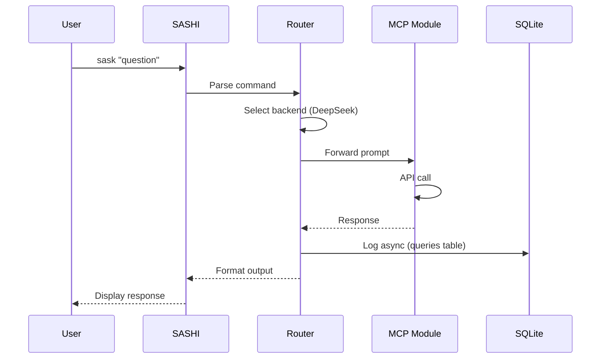

# SASHI - Smart AI Shell Interface

> Multi-model AI assistant with local (Ollama/Llama) and cloud (DeepSeek, Claude) providers, organized using MCP (Model Context Protocol) architecture.

[](https://github.com/tmdev012/ollama-local)
[]()
[]()

---

## Table of Contents

- [Overview](#overview)
- [Architecture](#architecture)
- [MCP Structure](#mcp-structure)
- [Installation](#installation)
- [Usage](#usage)
- [Refactoring Summary](#refactoring-summary)
- [SQLite Schema](#sqlite-schema)
- [Aliases Reference](#aliases-reference)
- [Tech Stack](#tech-stack)
- [Termux Sync](#termux-sync)
- [Smart Push](#smart-push)
- [Session Timeline](#session-timeline)

---

## Overview

SASHI routes your queries to the best AI backend:

```
┌─────────────────────────────────────────────────────────────┐
│                      USER INPUT                              │
│            text / voice / pipe / interactive                 │
└─────────────────────────────────────────────────────────────┘
                            │
                            ▼
┌─────────────────────────────────────────────────────────────┐
│                     SASHI v2.0.0                             │
│  ┌─────────┐  ┌─────────┐  ┌─────────┐  ┌─────────┐        │
│  │ Router  │→ │ Logger  │→ │ History │→ │ Output  │        │
│  └─────────┘  └─────────┘  └─────────┘  └─────────┘        │
└─────────────────────────────────────────────────────────────┘
        │              │              │              │
        ▼              ▼              ▼              ▼
┌───────────┐  ┌───────────┐  ┌───────────┐  ┌───────────┐
│ DeepSeek  │  │  Llama    │  │   Gmail   │  │   Voice   │
│   API     │  │  Ollama   │  │    API    │  │  Google   │
│  (Cloud)  │  │  (Local)  │  │  (OAuth)  │  │   STT     │
└───────────┘  └───────────┘  └───────────┘  └───────────┘
     Fast         Offline        Context        Input
```

### Process Map

```mermaid
flowchart TB
    subgraph Input["📥 Input Layer"]
        CLI[/"sashi CLI"/]
        Voice["🎤 Voice Input"]
        Pipe["📄 Pipe/Stdin"]
    end

    subgraph Router["🔀 SASHI Router v2.0"]
        Parse["Parse Command"]
        Route["Route to MCP"]
        Logger["Async Logger"]
    end

    subgraph MCP["📦 MCP Modules"]
        direction LR
        DeepSeek["☁️ DeepSeek<br/>Cloud API"]
        Llama["🦙 Llama 3.2<br/>Ollama Local"]
        Claude["🧠 Claude<br/>Opus 4.5"]
        Gmail["📧 Gmail<br/>Context API"]
        VoiceMod["🗣️ Voice<br/>Google STT"]
    end

    subgraph Storage["💾 Storage Layer"]
        SQLite[("SQLite DB<br/>4 tables<br/>11 indexes")]
        Backup["📁 Backups<br/>tree_*.txt"]
    end

    subgraph Output["📤 Output"]
        Terminal["Terminal"]
        GUI["Voice GUI"]
    end

    CLI --> Parse
    Voice --> VoiceMod
    Pipe --> Parse
    VoiceMod --> Parse

    Parse --> Route
    Route --> Logger

    Route -->|"ask, code"| DeepSeek
    Route -->|"local, stream"| Llama
    Route -->|"complex"| Claude
    Route -->|"gmail"| Gmail

    DeepSeek --> Terminal
    Llama --> Terminal
    Claude --> Terminal
    Gmail --> Terminal

    Logger --> SQLite

    subgraph SmartPush["🚀 Smart Push"]
        Categorize["Auto-categorize"]
        Version["Version Tag"]
        Commit["Git Commit"]
    end

    Commit --> SQLite
    Commit --> Backup

    style Input fill:#e1f5fe
    style Router fill:#fff3e0
    style MCP fill:#f3e5f5
    style Storage fill:#e8f5e9
    style Output fill:#fce4ec
    style SmartPush fill:#fff8e1
```



### Data Flow



### Smart Push Flow

```mermaid
flowchart LR
    A[git add -A] --> B{Categorize Files}
    B --> C[frontend]
    B --> D[backend]
    B --> E[config]
    B --> F[docs]

    C & D & E & F --> G[Generate Description]
    G --> H[Version Tag?]
    H -->|yes| I[v0.0.X]
    H -->|no| J[skip]
    I & J --> K[Issue Link?]
    K --> L[git commit]
    L --> M[git push]
    M --> N[(SQLite commits)]
    M --> O[📁 tree backup]

    style A fill:#bbdefb
    style L fill:#c8e6c9
    style M fill:#c8e6c9
    style N fill:#e8f5e9
    style O fill:#fff3e0
```



---

## Architecture

### Directory Structure

```
ollama-local/
├── sashi                    # Main CLI (v2.0.0)
├── .env                     # API keys & config
├── install.sh               # One-command installer
├── Dockerfile               # Container build
├── docker-compose.yml       # Container orchestration
│
├── db/
│   └── history.db           # SQLite (4 tables, 11 indexes)
│
├── backups/
│   └── tree_*.txt           # File tree snapshots (auto-rotated)
│
├── mcp/                     # Model Context Protocol
│   ├── claude/              # Claude Opus 4.5
│   │   ├── config/model.json
│   │   └── resources/
│   │
│   ├── deepseek/            # DeepSeek API
│   │   ├── config/model.json
│   │   └── tools/
│   │
│   ├── llama/               # Llama 3.2 (Ollama)
│   │   ├── config/model.json
│   │   └── tools/
│   │
│   ├── gmail/               # Gmail API
│   │   ├── config/
│   │   └── tools/gmail-cli
│   │
│   └── voice/               # Voice Input
│       ├── config/model.json
│       └── tools/
│           ├── voice-input  # CLI
│           └── voice-gui    # Desktop GUI
│
├── scripts/
│   ├── git-setup.sh         # SSH/GitHub setup
│   ├── git-aliases.sh       # Git alias installer
│   ├── smart-push.sh        # Intelligent git commit (v2.0)
│   └── termux-sync.sh       # Cross-device sync
│
├── archive/                 # Previous versions
└── logs/
```

---

## MCP Structure

### 6 MCP Groups

| Category | Name | Type | Description |
|----------|------|------|-------------|
| **Core** | sashi | CLI | Main router and interface |
| **Model** | claude | Cloud API | Claude Opus 4.5 - Complex reasoning |
| **Model** | deepseek | Cloud API | DeepSeek Chat - Fast, cheap |
| **Model** | llama | Local | Llama 3.2 via Ollama - Offline |
| **Protocol** | voice | Input | Google Speech-to-Text |
| **Protocol** | gmail | Context | Gmail API for email data |

### Model Comparison

| Model | Type | Speed | Context | Cost | Use Case |
|-------|------|-------|---------|------|----------|
| DeepSeek | Cloud | ~2s | 64K | $0.14/M | General, code |
| Llama 3.2 | Local | ~2-5s | 2K* | Free | Offline |
| Claude Opus | Cloud | ~3s | 200K | $$$ | Complex tasks |

*Optimized context window for speed

---

## Installation

### Quick Install (Linux/macOS)

```bash
git clone git@github.com:tmdev012/ollama-local.git
cd ollama-local
./install.sh
```

### Manual Install

```bash
# 1. Install Ollama
curl -fsSL https://ollama.ai/install.sh | sh
sudo systemctl enable --now ollama
ollama pull llama3.2

# 2. Clone repo
git clone git@github.com:tmdev012/ollama-local.git ~/ollama-local

# 3. Configure
cp ~/ollama-local/.env.example ~/ollama-local/.env
# Edit .env with your DeepSeek API key

# 4. Add to shell
echo 'source ~/ollama-local/scripts/git-aliases.sh' >> ~/.bashrc
source ~/.bashrc
```

### Docker

```bash
docker-compose up -d
docker exec -it sashi-ai bash
```

---

## Usage

### Basic Commands

```bash
# Quick question (DeepSeek - fast)
s "What is Python?"
sask "Explain REST APIs"

# Code help (DeepSeek)
scode "Write a sorting function in Python"

# Offline mode (Llama)
slocal "What is recursion?"

# Interactive chat
schat              # DeepSeek
schat --local      # Llama

# Voice input
sashi voice              # Single prompt
sashi voice --continuous # Keep listening
sashi voice --gui        # Desktop app

# System status
sstatus
smodels
shistory
```

### Pipe Support

```bash
cat code.py | scode "explain this"
git diff | review
cat README.md | summarize
```

### Git Pipeline

```bash
gitpush "commit message"   # Add + Commit + Push
gpp "message"              # Short alias
ship "message"             # Another alias
gship                      # Interactive mode
```

---

## Refactoring Summary

### Before vs After

| Aspect | Before (v1.0) | After (v2.0) |
|--------|---------------|--------------|
| **Llama Query** | `ollama run` (CLI) | HTTP API |
| **Query Speed** | 5-8 seconds | **2.2 seconds** |
| **Status Check** | `systemctl` (100ms) | Cached curl (10ms) |
| **Logging** | Blocking Python | Async background |
| **Context Window** | 8192 tokens | 2048 tokens |
| **Shell Aliases** | 43 (duplicates) | **22 (clean)** |
| **Bashrc Lines** | 565 | **190** |
| **SQLite Indexes** | 0 | **9** |
| **Voice Support** | None | CLI + GUI |
| **Docker** | None | Full support |

### Performance Improvements

```
Llama Query (warm):  5-8s  →  2.2s   (3x faster)
Status Check:        600ms →  100ms  (6x faster)
Logging:             200ms →  0ms    (async)
Shell Load:          ~2s   →  ~0.5s  (4x faster)
```

### Alias Cleanup

**Removed (broken/duplicate):**
- 7 duplicate `ai` alias blocks
- 4 broken `aipipe` references
- 3 non-functional model switchers
- 12 orphan echo statements
- Triple `starship init`

**Added (new):**
- SASHI aliases (`s`, `sask`, `scode`, `slocal`, etc.)
- Git pipeline (`gitpush`, `gpp`, `ship`, `gship`)
- Termux sync (`termux-sync`)

---

## SQLite Schema

### ERD Diagram

```
┌─────────────────────────────────────┐
│            queries                  │
├─────────────────────────────────────┤
│ PK id              INTEGER          │
│    timestamp       DATETIME         │
│    model           TEXT        ◄────┼─── idx_queries_model
│    prompt          TEXT             │
│    response_length INTEGER          │
│    duration_ms     INTEGER     ◄────┼─── idx_queries_duration
│                               ◄─────┼─── idx_queries_timestamp
└───────────────┬─────────────────────┘
                │ 1:N
┌───────────────▼─────────────────────┐
│           favorites                 │
├─────────────────────────────────────┤
│ PK id              INTEGER          │
│ FK query_id        INTEGER     ◄────┼─── idx_favorites_query
│    label           TEXT             │
└─────────────────────────────────────┘

┌─────────────────────────────────────┐
│          mcp_groups                 │
├─────────────────────────────────────┤
│ PK id              INTEGER          │
│    name            TEXT (UNIQUE)    │
│    category        TEXT        ◄────┼─── idx_mcp_groups_category
│    description     TEXT             │
│    config_path     TEXT             │
│    enabled         INTEGER     ◄────┼─── idx_mcp_groups_enabled
│    created_at      DATETIME         │
│    updated_at      DATETIME         │
└─────────────────────────────────────┘

┌─────────────────────────────────────┐
│            commits                  │
├─────────────────────────────────────┤
│ PK id              INTEGER          │
│    hash            TEXT        ◄────┼─── idx_commits_hash
│    message         TEXT             │
│    auto_description TEXT            │
│    issue_number    TEXT        ◄────┼─── idx_commits_issue
│    version_tag     TEXT        ◄────┼─── idx_commits_version
│    branch          TEXT             │
│    files_changed   INTEGER          │
│    lines_added     INTEGER          │
│    lines_deleted   INTEGER          │
│    categories      TEXT             │
│    timestamp       DATETIME         │
│    tree_backup     TEXT             │
└─────────────────────────────────────┘
```

### Tables

| Table | Rows | Indexes | Purpose |
|-------|------|---------|---------|
| queries | N | 3 | AI query history |
| favorites | N | 1 | Starred queries |
| mcp_groups | 6 | 2 | MCP provider registry |
| commits | N | 5 | Smart push commit tracking |

### Indexes (11 total)

```sql
-- queries
CREATE INDEX idx_queries_model ON queries(model);
CREATE INDEX idx_queries_timestamp ON queries(timestamp);
CREATE INDEX idx_queries_duration ON queries(duration_ms);

-- favorites
CREATE INDEX idx_favorites_query ON favorites(query_id);

-- mcp_groups
CREATE INDEX idx_mcp_groups_category ON mcp_groups(category);
CREATE INDEX idx_mcp_groups_enabled ON mcp_groups(enabled);

-- commits
CREATE INDEX idx_commits_hash ON commits(hash);
CREATE INDEX idx_commits_version ON commits(version_tag);
CREATE INDEX idx_commits_issue ON commits(issue_number);
CREATE INDEX idx_commits_branch ON commits(branch);
CREATE INDEX idx_commits_timestamp ON commits(timestamp);
```

---

## Aliases Reference

### SASHI (AI)

| Alias | Command | Description |
|-------|---------|-------------|
| `s` | `sashi` | Main interface |
| `sask` | `sashi ask` | Quick question (DeepSeek) |
| `scode` | `sashi code` | Code help (DeepSeek) |
| `slocal` | `sashi local` | Offline (Llama) |
| `schat` | `sashi chat` | Interactive chat |
| `sstatus` | `sashi status` | System status |
| `smodels` | `sashi models` | List models |
| `shistory` | `sashi history` | Query history |
| `sgmail` | `sashi gmail` | Email context |

### Git

| Alias | Command | Description |
|-------|---------|-------------|
| `gs` | `git status -sb` | Short status |
| `gd` | `git diff` | Show diff |
| `gl` | `git log --oneline -20` | Short log |
| `ga` | `git add` | Stage files |
| `gaa` | `git add -A` | Stage all |
| `gc` | `git commit -m` | Commit |
| `gp` | `git push` | Push |
| `gpl` | `git pull` | Pull |
| `gb` | `git branch` | Branches |
| `gco` | `git checkout` | Checkout |

### Git Pipeline

| Alias | Description |
|-------|-------------|
| `gitpush "msg"` | Add + Commit + Push |
| `gpp "msg"` | Short for gitpush |
| `ship "msg"` | Another alias |
| `gship` | Interactive (prompts for message) |

### Smart Push (v2.0)

| Alias | Description |
|-------|-------------|
| `smartpush` | Full interactive smart commit |
| `sp` | Short alias for smartpush |
| `gpush` | Another alias |
| `ghist` | View commit history from SQLite |
| `gver` | List all version tags |
| `gissue "N"` | Find commits by issue number |

### Ollama

| Alias | Command | Description |
|-------|---------|-------------|
| `ollama-up` | `systemctl start ollama` | Start service |
| `ollama-down` | `systemctl stop ollama` | Stop service |
| `ollama-status` | Check status + list | Status |
| `ollama-logs` | `journalctl -u ollama` | View logs |

### Pipe Helpers

| Alias | Description |
|-------|-------------|
| `analyze` | `cat file \| analyze` |
| `summarize` | `cat file \| summarize` |
| `explain` | `cat file \| explain` |
| `review` | `cat file \| review` |

---

## Tech Stack

| Component | Technology |
|-----------|------------|
| **Shell** | Bash / Zsh |
| **Local AI** | Ollama + Llama 3.2 |
| **Cloud AI** | DeepSeek API |
| **Database** | SQLite 3 |
| **Voice** | Google Speech-to-Text |
| **GUI** | Python Tkinter |
| **Container** | Docker + Compose |
| **VCS** | Git + GitHub |
| **Auth** | SSH (ED25519) |

### Dependencies

```bash
# System
curl jq python3 sqlite3

# Ollama
ollama (+ llama3.2 model)

# Voice (optional)
portaudio19-dev python3-pyaudio python3-tk
pip3 install SpeechRecognition
```

---

## Termux Sync

Sync shell configs between devices (Linux ↔ Android/Termux).

### Usage

```bash
# On Linux - backup to GitHub
termux-sync push

# On Termux - restore from GitHub
git clone git@github.com:tmdev012/ollama-local.git
cd ollama-local
./scripts/termux-sync.sh pull
```

### Commands

| Command | Description |
|---------|-------------|
| `termux-sync push` | Upload configs to GitHub |
| `termux-sync pull` | Download configs from GitHub |
| `termux-sync status` | Show sync status |
| `termux-sync auto` | Enable auto-sync on exit |

### Synced Files

- `~/.bashrc`
- `~/.zshrc`
- `~/.bash_history`
- `~/.zsh_history`
- `~/.gitconfig`
- `~/.ssh/config`

---

## Environment Variables

```bash
# .env file
DEEPSEEK_API_KEY=sk-xxx        # Required for cloud AI
DEFAULT_MODEL=deepseek-chat    # Default cloud model
LOCAL_MODEL=llama3.2           # Default local model
OLLAMA_HOST=http://localhost:11434

# Git
GIT_USER=tmdev012
GIT_EMAIL=tmdev012@users.noreply.github.com
GIT_REPO=ollama-local

# MCP Groups
MCP_GROUPS=core,claude,deepseek,llama,voice,gmail
```

---

## Smart Push

Intelligent git commit system with auto-categorization, version tagging, and issue linking.

### Features

- **Auto-categorization**: Files categorized by extension
- **Branch comparison**: Shows ahead/behind vs main
- **Version tagging**: Semantic versioning with auto-increment
- **Issue linking**: Links commits to GitHub issues
- **File tree backup**: Snapshots before each commit
- **SQLite tracking**: All commits stored with metadata

### File Categories

| Category | Extensions |
|----------|------------|
| `frontend:styles` | html, css, scss, sass, less |
| `frontend:script` | js, jsx, ts, tsx, vue, svelte |
| `backend:python` | py, pyw |
| `scripts:shell` | sh, bash, zsh, fish |
| `config` | json, yaml, yml, toml, ini, conf, env |
| `database` | sql, db, sqlite |
| `docs` | md, txt, rst, doc |
| `devops:docker` | Dockerfile, docker-compose* |
| `testing` | test*, *_test.*, *spec.* |
| `mcp:module` | mcp/* directory |

### Usage

```bash
# Interactive mode
smartpush

# Output includes:
# [1/8] Branch comparison (feature vs main)
# [2/8] File tree backup
# [3/8] File changes by category
# [4/8] Diff summary (+lines/-lines)
# [5/8] Auto-generated description
# [6/8] Commit details (version tag, issue #)
# [7/8] Commit
# [8/8] Push
```

### Query History

```bash
# View commit history
ghist

# List version tags
gver

# Find commits by issue
gissue 42
```

---

## Session Timeline

### Git Commit History (10-hour session)

| Commit | Tag | Description | Files |
|--------|-----|-------------|-------|
| `faaef58` | - | Clean: MCP structure with sashi CLI | 16 |
| `b57005f` | - | Add Gmail module for email context | 4 |
| `b619c56` | - | v2.0.0: SASHI optimization, voice, Git/SSH | 17 |
| `373647c` | - | Add termux-sync for cross-device backup | 2 |
| `d0445aa` | - | Add comprehensive README | 1 |
| `1ff6995` | - | Add smart-push v2.0 | 1 |
| `1904374` | v0.0.1 | Smart alias for YAML webhooks | 1 |
| `4c1981b` | v0.0.2 | Filetree update - structure changes | 1 |
| `bcef945` | - | Timestamped filetree monitoring | 1 |
| `0ef3279` | - | MCP module directories consistency | 3 |

### Session Stats

```
Total commits:     10
Files created:     30+
Files modified:    12
Lines added:       4,500+
Lines deleted:     400+
Tables created:    4
Indexes created:   11
Aliases added:     25+
Duration:          ~10 hours
```

### Key Accomplishments

1. **MCP Architecture** - 6 modules (claude, deepseek, llama, voice, gmail, core)
2. **SASHI v2.0** - HTTP API optimization (5-8s → 2.2s)
3. **Voice Input** - CLI + GUI with Google Speech-to-Text
4. **Smart Push** - Auto-categorization, versioning, SQLite tracking
5. **Alias Cleanup** - 43 broken → 22 clean MCP-aligned
6. **SQLite Schema** - 4 tables, 11 indexes
7. **Git/SSH Setup** - ED25519 keys, GitHub auth
8. **Docker Support** - Full containerization
9. **Termux Sync** - Cross-device config backup
10. **Documentation** - README, CHANGELOG, schema docs

---

## Contributing

```bash
# Clone
git clone git@github.com:tmdev012/ollama-local.git
cd ollama-local

# Make changes
# ...

# Push
gitpush "Description of changes"
```

---

## License

MIT

---

## Credits

- **Author:** tmdev012
- **AI Assistant:** Claude Opus 4.5 (Anthropic)
- **Models:** Meta Llama, DeepSeek

---

*Generated with Claude Code CLI - Feb 2026*
