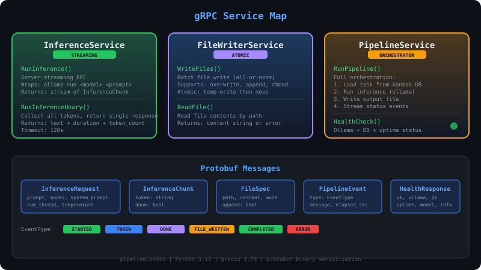

# gRPC Pipeline — ollama-local Automation Engine

> Kanban governs intake. Ollama-local + gRPC delivers automation. Consolidated.

<p align="center">
  
</p>

## What This Is

A gRPC automation layer inside `ollama-local` that replaces flaky HTTP/curl pipelines with proper streaming RPC. Runs inference via `ollama run` (native CLI, model stays hot), writes files atomically, and orchestrates full pipelines from kanban task intake to output.

**Zero cloud. Fully offline. CPU-only optimized.**

---

## Data Flow

<p align="center">
  
</p>

### How a request flows:

1. **Client** (sashi CLI, MCP `pipe-run`, or Python script) sends gRPC call to `:50051`
2. **gRPC Router** deserializes protobuf, dispatches to the right service
3. **Service Handler** executes: spawns `ollama run`, writes files, or orchestrates a full pipeline
4. **Backend** (ollama, filesystem, SQLite) does the work — tokens stream back in real-time

---

## Services

<p align="center">
  
</p>

### InferenceService

| Method | Type | Description |
|--------|------|-------------|
| `RunInference` | server-streaming | Stream tokens from `ollama run` in real-time |
| `RunInferenceUnary` | unary | Collect all tokens, return single response with timing |

### FileWriterService

| Method | Type | Description |
|--------|------|-------------|
| `WriteFiles` | unary | Atomic batch file write (all-or-none, temp+move) |
| `ReadFile` | unary | Read file contents by path |

### PipelineService

| Method | Type | Description |
|--------|------|-------------|
| `RunPipeline` | server-streaming | Full orchestration: task load → inference → file write |
| `HealthCheck` | unary | Ollama + DB + uptime status |

---

## Quick Start

```bash
# Start the gRPC server
cd ~/ollama-local/pipeline
make server

# In another terminal — health check
make health

# Or use the bash client
./client.sh health
./client.sh infer "explain quicksort in 3 lines"
./client.sh stream "write a haiku about gRPC"
./client.sh write /tmp/test.txt "hello from pipeline"
./client.sh pipeline "summarize binary search" /tmp/summary.txt
```

### From sashi (MCP tool)

```bash
# The pipe-run MCP tool wraps the gRPC client
pipe-run health
pipe-run infer "what is a monad"
pipe-run pipeline "explain TCP handshake" ~/output/tcp.md
```

---

## File Structure

```
pipeline/
├── proto/
│   └── pipeline.proto        # gRPC service + message definitions
├── generated/
│   ├── pipeline_pb2.py       # Compiled protobuf messages
│   └── pipeline_pb2_grpc.py  # Compiled gRPC stubs
├── server.py                 # gRPC server (all 3 services)
├── client.py                 # Python CLI client
├── client.sh                 # Bash wrapper for client.py
├── requirements.txt          # grpcio, grpcio-tools, protobuf
├── Makefile                  # proto compile + run targets
├── assets/
│   ├── architecture.svg      # Animated architecture diagram
│   ├── data-flow.svg         # Request lifecycle animation
│   └── services.svg          # Service map with proto messages
└── README.md                 # This file
```

### MCP Integration

```
mcp/pipeline/
├── config/
│   └── model.json            # MCP tool metadata
└── tools/
    └── pipe-run              # Executable bash tool for sashi
```

---

## Performance Notes

| Setting | Value | Why |
|---------|-------|-----|
| `num_thread` | **2** | Physical cores on i7-6500U. HT (4 threads) is **30% slower** |
| CPU governor | `performance` | `powersave` kills inference speed |
| Transport | `ollama run` (CLI) | Native streaming, keeps model hot. NOT `curl /api/generate` |
| 3B model | ~4.0 tok/s | llama3.2 default |
| 8B model | ~3.7 tok/s | Slightly slower but more capable |
| gRPC | streaming | Avoids 15s+ timeout from blocking HTTP calls |

---

## BDPM: Production Swimlane

This gRPC pipeline implements the **Production** layer of the BDPM governance model: `gRPC Dispatch → Ollama Inference → File Write → DB Log`. See the full 4-layer swimlane diagram at [`kanban-pmo/docs/diagrams/bdpm-swimlanes.svg`](../../kanban-pmo/docs/diagrams/bdpm-swimlanes.svg).

---

## Architecture: The Big Picture

```
┌──────────────┐     ┌─────────────────────┐     ┌────────────┐
│  KANBAN-PMO  │────>│                     │────>│   OLLAMA   │
│  (intake)    │     │   gRPC Pipeline     │     │ llama3.2   │
└──────────────┘     │   Server :50051     │     └────────────┘
                     │                     │
┌──────────────┐     │  InferenceService   │     ┌────────────┐
│  SASHI CLI   │────>│  FileWriterService  │────>│ FILESYSTEM │
│  (v3.0)      │     │  PipelineService    │     │  (atomic)  │
└──────────────┘     │                     │     └────────────┘
                     │                     │
┌──────────────┐     │  protobuf binary    │     ┌────────────┐
│  MCP TOOLS   │────>│  server-streaming   │────>│  SQLITE DB │
│  pipe-run    │     │  atomic writes      │     │ history.db │
└──────────────┘     └─────────────────────┘     └────────────┘
```

**Kanban governs the intake** — tasks flow from `kanban-pmo` backlog/wip boards.
**Ollama-local + gRPC delivers automation** — this pipeline executes them.
**One repo** — consolidated in `~/ollama-local/pipeline/`.

---

## Developing

```bash
# Recompile proto after changes
make proto

# Run server in foreground (Ctrl+C to stop)
make server

# Run server in background
make server-bg

# Clean generated files
make clean
```

### Python client library usage

```python
from pipeline.generated import pipeline_pb2, pipeline_pb2_grpc
import grpc

with grpc.insecure_channel('localhost:50051') as ch:
    stub = pipeline_pb2_grpc.InferenceServiceStub(ch)
    for chunk in stub.RunInference(
        pipeline_pb2.InferenceRequest(prompt="hello")
    ):
        print(chunk.token, end="", flush=True)
```
